# bigdata-personal
> ABC 전문가 과정 - Data Track (Advanced) : Docker 개인 과제

## ✅ 데이터 품질 요구사항은 [DataQuality.md](./DataQuality.md) 파일 참고

## 🏗️ 프로젝트 전체 구조

---

## 1. Project Clone
```bash
git clone https://github.com/roats/bigdata-personal.git
```
---

## 2. Docker Compose 실행 및 i1 컨테이너 접속
```bash
cd bigdata-personal
docker-compose up --build -d
docker exec -it i1 bash
/root/setup-ssh.sh
```
---

## 3. Ansible 사용하여 Hadoop, Spark, Kafka 설치 및 Hadoop 실행 (i1에서 실행)
```bash
cd /df
wget https://downloads.apache.org/hadoop/common/hadoop-3.3.6/hadoop-3.3.6.tar.gz
wget https://archive.apache.org/dist/spark/spark-3.4.4/spark-3.4.4-bin-hadoop3.tgz

ansible-playbook --flush-cache -i /df/ansible-hadoop/hosts /df/ansible-hadoop/hadoop_install.yml
ansible-playbook --flush-cache -i /df/ansible-spark/hosts /df/ansible-spark/spark_install.yml -e ansible_python_interpreter=/usr/bin/python3.12
ansible-playbook --flush-cache -i /df/ansible-kafka/hosts /df/ansible-kafka/kafka_install.yml -e ansible_python_interpreter=/usr/bin/python3.12
source /etc/bashrc

startAll
```
---

## 4. Producer 실행 (i1에서 실행)
```bash
tmux new-session -d -s producer 'python3 /df/kafka-producer/fms_producer.py'
```
---

## 5. Spark, Kafka 실행 및 토픽 생성 (s1에서 실행)
```bash
$SPARK_HOME/sbin/start-all.sh
pip install -r /df/kafka-setting/requirements.txt
pip install --upgrade pip setuptools packaging
bash /df/kafka-setting/manage_kafka.sh start
bash /df/kafka-setting/manage_topics.sh create
bash /df/kafka-setting/manage_topics.sh list
jps
```
---

## 6. Slack WebHook URL 환경 변수 등록 (s1에서 실행)
```bash
echo 'export SLACK_WEBHOOK_URL="https://hooks.slack.com/services/XXXXX/XXXXX/XXXXXXXXXX"' >> /etc/bashrc
source /etc/bashrc
```
---

## 7. Consumer, Processor 실행 (s1에서 실행)
```bash
tmux new-session -d -s consumer 'bash -c "source /etc/bashrc && python3 /df/kafka-consumer/fms_consumer.py"'
tmux new-session -d -s processor 'spark-submit --packages org.apache.spark:spark-sql-kafka-0-10_2.12:3.4.4 /df/spark-processor/fms_processor.py'
tmux new-session -d -s alert_consumer 'bash -c "source /etc/bashrc && python3 /df/kafka-consumer/fms_alert_consumer.py"'
```
---

## 8. Spark 처리 결과 확인 (s1에서 실행)
```bash
hdfs dfs -ls -R /fms/
spark-submit /df/spark-processor/fms_processing_result.py <YYYY-MM-DD-HH>
```
---

## 9. Airflow 설치 및 실행 (i1에서 실행)
```bash
python3 -m venv ~/airflow_venv
source ~/airflow_venv/bin/activate

pip install apache-airflow

airflow db migrate
vi ~/airflow/airflow.cfg # load_examples = False 로 수정

mkdir ~/airflow/dags/
cp /df/airflow/device_error_summary_dag.py ~/airflow/dags/

tmux new-session -d -s airflow 'airflow standalone'

cat ~/airflow/simple_auth_manager_passwords.json.generated
# airflow dags unpause device_error_summary
```
- http://localhost:9000/
---

## 10. Prometheus & Grafana 확인
- Prometheus : http://localhost:9090/
- Grafana : http://localhost:3000/

- Grafana (admin/admin)
- Connections > Data Sources > Add new data source > Prometheus > http://localhost:9090 입력 > Save & Test
- DashBoards > Create Dashboard > Import a dashboard > `1860` (Node Exporter Full) Load > Prometheus > import
---

## 11. Processor, Consumer, Kafka, Spark 종료 (s1에서 실행)
```bash
tmux kill-session -t alert_consumer
tmux kill-session -t processor
tmux kill-session -t consumer
bash /df/kafka-setting/manage_kafka.sh stop
$SPARK_HOME/sbin/stop-all.sh
```
---

## 12. Airflow, Producer, Hadoop 종료 (i1에서 실행)
```bash
tmux kill-session -t airflow
tmux kill-session -t producer
stopAll
```
---

## 13. Docker Compose 종료
```bash
docker-compose stop
```
